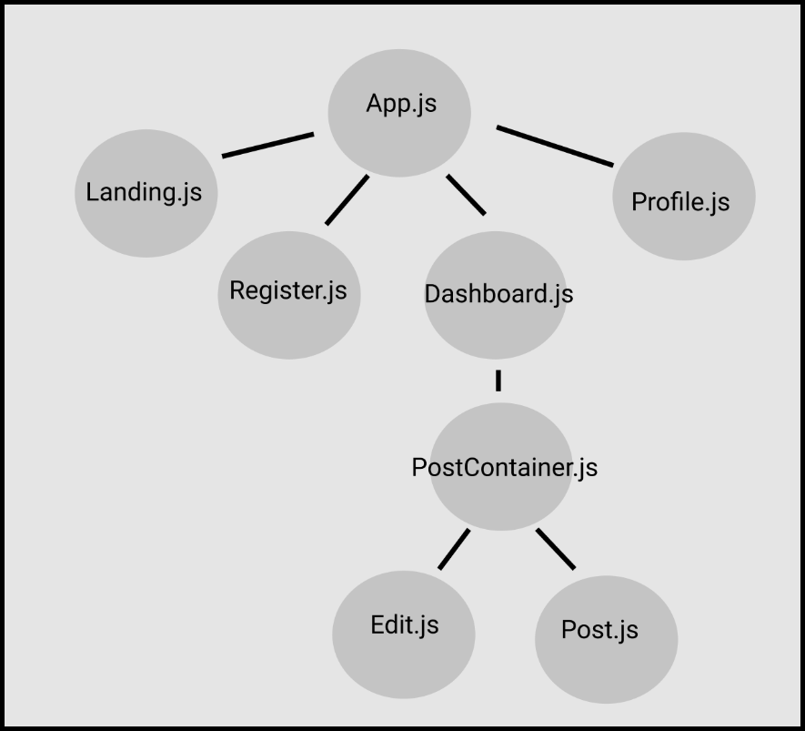

# Simple Social



## MVP
- Login functionality
- Post posts
- Delete/edit posts
- Control the view based on authorization

**Icebox**
- Delete account
- Play music
- Customize background
- Datamine customers
- Fave Five List

## Database
User
```sql
CREATE TABLE users (
  user_id SERIAL PRIMARY KEY,
  email VARCHAR(100),
  password TEXT
);
```

Post
```sql
CREATE TABLE posts (
  post_id SERIAL PRIMARY KEY,
  user_id INT REFERENCES users(user_id),
  content VARCHAR(255),
  created_at TIMESTAMP DEFAULT now()
);
```

## Server

### Dependencies
- express
- express-session
- massive
- dotenv
- bcrypt

#### Endpoints
##### Auth
- app.post('/auth/login')
- app.post('/auth/register')
- app.delete('/auth/logout')
- app.get('/auth/user')

##### Post
- app.get('/api/posts')
- app.post('/api/post')
- app.put('/api/posts/:post_id')
- app.delete('/api/posts/:post_id')

## Client

### Dependencies
- axios
- react-router-dom
- redux
- react-redux
- redux-promise-middleware

### Routes
- Landing /
- Register /register
- Dashboard /dashboard
- Profile /profile

## File Structure
- src/
  - App.js
  - App.css
  - index.js
  - reset.css
  - redux/
    - store
    - reducer
  - components/
    - Landing.js / .css
    - Register.js /.css
    - Dashboard.js / .css
    - Profile.js / .css
    - PostContainer.js / .css
    - Post.js / .css
    - Edit.js / .css
    - Header.js / .css
    - AuthHeader.js /.css

